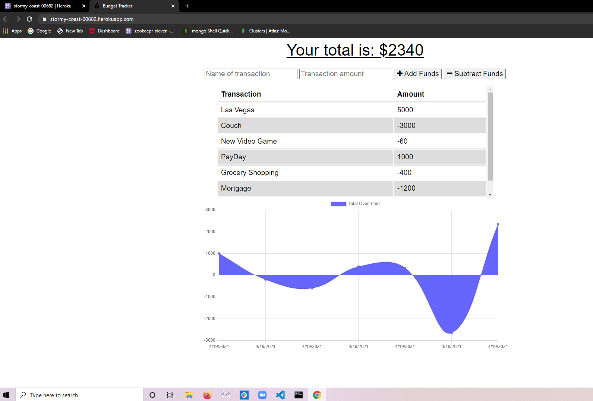

# Budget Tracker

## Description
Budget Tracker is an application where a user will submit a transaction name, the total of the transaction, and to either add funds or subtrack funds. The great part about this is it's also a PWA. So if the user loses internet connection while home or on the go, the user can still store transactions that are saved in an indexedDB. After the user regains access to the internet, those saved transactions will automatically be uploaded to the application's server. The user doesn't have to do anything it's automatic! This application also contains a service worker and manifest.json.

## Table of Contents
- [Budget Tracker](#budget-tracker)
  - [Description](#description)
  - [Table of Contents](#table-of-contents)
  - [Installation](#installation)
  - [Usage](#usage)
  - [Questions](#questions)

## Installation
No steps required.

## Usage
https://stormy-coast-00682.herokuapp.com/

## Questions
Steven Baty
batysteven1@gmail.com
http://github.com/batysteven
Please reach out to me either by github or my email if you have any questions.

http://github.com/batysteven
[GitHub](http://github.com/batysteven)
